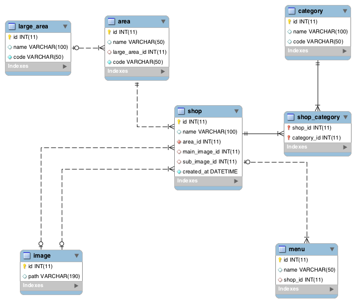

# Sdx.Db.Record

## 概要

各テーブルの一行を表現したクラス。`RecordSet`は複数の`Record`のコレクションです。

## 使い方

### クラスの準備

`Record`は`Adapter.FetchRecord<T:Record>(DbCommand command)`あるいは`Adapter.FetchRecord<T:Record>(Select select)`で生成しますが、組み立てるのにテーブルの定義が必要です。テーブルの定義は`Sdx.Db.Table`クラスのサブクラスを作成して行います。

`Record`クラス自体も、各テーブルごとに固有のユーティリティーメソッドを持たせたいので、サブクラスを作成します。

下記のDBを元に解説をします。

 

#### Tableクラス

基本的な設定です。Tableクラス自体は各SELECTの中でJOINに利用され、JOIN時のデータを保有するため、複数生成されるクラスです。Tableの定義自体はユニークなものなので`Sdx.Db.TableMeta`クラスのインスタンスとしてstaticなプロパティに保持します。本来はテーブル同士の関係も定義しますが、話を単純にするため、最初の例では省略します。

```c#
using System.Collections.Generic;

namespace Test.Orm.Table
{
  class Shop : Sdx.Db.Table
  {
    public static Sdx.Db.TableMeta Meta { get; private set; }

    static Shop()
    {
      Meta =  new Sdx.Db.TableMeta(
        "shop",
        new List<string>()
        {
          "id"
        },
        new List<Column>()
        {
          new Column("id"),
          new Column("name"),
          new Column("area_id"),
          new Column("main_image_id"),
          new Column("sub_image_id"),
        },
        new Dictionary<string, Relation>()
        {
          //他テーブルとの関係を設定します。
        },
        typeof(Test.Orm.Shop),
        typeof(Test.Orm.Table.Category)
      );
    }
  }
}
```

`TableMeta`コンストラクタの引数は下記のようになっています。

1. テーブル名
1. 主キー
1. カラムのリスト
1. 他テーブルとの関連（`Relation`）
1. Recordクラスのタイプ
1. Tableクラスのタイプ

#### レコードクラス

レコードクラスからもテーブル定義にアクセスできるようするためstaticなプロパティが必要です。

```c#
namespace Test.Orm
{
  public class Shop : Sdx.Db.Record
  {
    public static Sdx.Db.TableMeta Meta { get; private set; }

    static Shop()
    {
      Meta = Test.Orm.Table.Shop.Meta;
    }
  }
}
```

#### リレーションを貼る

`shop`は複数の`menu`を持っています。この関係を設定してみます。

```c#
using System.Collections.Generic;

namespace Test.Orm.Table
{
  class Shop : Sdx.Db.Table
  {
    public static Sdx.Db.TableMeta Meta { get; private set; }

    static Shop()
    {
      Meta =  new Sdx.Db.TableMeta(
        "shop",
        new List<string>()
        {
          "id"
        },
        new List<Column>()
        {
          new Column("id"),
          new Column("name"),
          new Column("area_id"),
          new Column("main_image_id"),
          new Column("sub_image_id"),
        },
        new Dictionary<string, Relation>()
        {
          {
            "menu",
            new Relation(
              typeof(Test.Orm.Table.Menu),
              "id",
              "shop_id"
            )
          }
        },
        typeof(Test.Orm.Shop),
        typeof(Test.Orm.Table.Category)
      );
    }
  }
}
```

`Sdx.Db.Table.Relation`のインスタンスで関連を設定します。コンストラクタの引数は下記のようになっています。

1. TableクラスのType
1. 自分自身の参照カラム。`shop.id`になります。
1. 相手テーブルの参照ラカム。`menu.shop_id`です。

このようにして、テーブル同士の関係を設定していきます。[ユニットテストのテーブルクラス](../UnitTest/Test/Orm/Table)で様々な設定を確認できますので参考にしてください。


<br><br><br>
### Tableを使ったSELECTの組み立て

#### 単純な問い合わせ

```c#
var select = new Sdx.Db.Query.Select();
select.AddFrom(new Test.Orm.Table.Shop());

var db = new Sdx.Db.SqlServerAdapter();
db.ConnectionString = "DB CONNECTION STRING";
var shops = db.FetchRecordSet<Test.Orm.Shop>(select);
```

`Select.AddFrom`にTableのインスタンスをセットすると、カラムはTableMetaに設定したカラムが自動で全て追加されます。

`Adapter.FetchRecordSet<>(select)`/`Adapter.FetchRecord<>(select)`はジェネリックメソッドでタイプには取得したいRecordクラスの型を渡します。通常はFROM句にしていしたテーブルのRecordを渡します。


カラムを変更したい場合はSetColumns`Table.SetColumn()`/`Table.ClearColumn()`/`Table.AddColumn()`などのTableの絡む操作系メソッドを使用してください。

```c#
select
  .AddFrom(new Test.Orm.Table.Shop())
  .SetColumns("id", "name");
```

#### 一対多をJOINする

一対多の関係のテーブルをJOINすると、レコードが重複します。例えば、shopテーブルにmenuテーブルをJOINした場合、2つメニューを持ったお店は2行になって現れます。RecordSetはこれをうまくまとめてれます。

```sql
INSERT INTO shop (name, created_at, area_id) VALUES ('天府舫', '2015-01-03 12:30:00', (SELECT id FROM area WHERE name = '新宿'));

INSERT INTO menu (name, shop_id) VALUES ('干し豆腐のサラダ', (SELECT id FROM shop WHERE name = '天府舫'));
INSERT INTO menu (name, shop_id) VALUES ('麻婆豆腐', (SELECT id FROM shop WHERE name = '天府舫'));
INSERT INTO menu (name, shop_id) VALUES ('牛肉の激辛水煮', (SELECT id FROM shop WHERE name = '天府舫'));
```

```c#
var select = new Sdx.Db.Query.Select();

select
   .AddFrom(new Test.Orm.Table.Shop())
   .AddOrder("id", Sdx.Db.Query.Order.ASC)
   ;

select.Context("shop")
   .InnerJoin(new Test.Orm.Table.Menu())
   .AddOrder("id", Sdx.Db.Query.Order.ASC)
   ;

select.Context("shop")
    .Where.Add("name", "天府舫");

var shops = db.FetchRecordSet<Test.Orm.Shop>(select);
Assert.Equal(1, db.Profiler.Queries.Count);//データベースへの問い合わせは回数をチェック

Assert.Equal(1, shops.Count);
Assert.Equal("天府舫", shops[0].GetString("name"));

var menuList = shops[0].GetRecordSet<Test.Orm.Menu>("menu");
Assert.Equal(1, db.Profiler.Queries.Count);//新たに問い合わせはしていない
Assert.Equal(3, menuList.Count);
Assert.Equal("干し豆腐のサラダ", menuList[0].GetString("name"));
Assert.Equal("麻婆豆腐", menuList[1].GetString("name"));
Assert.Equal("牛肉の激辛水煮", menuList[2].GetString("name"));
```