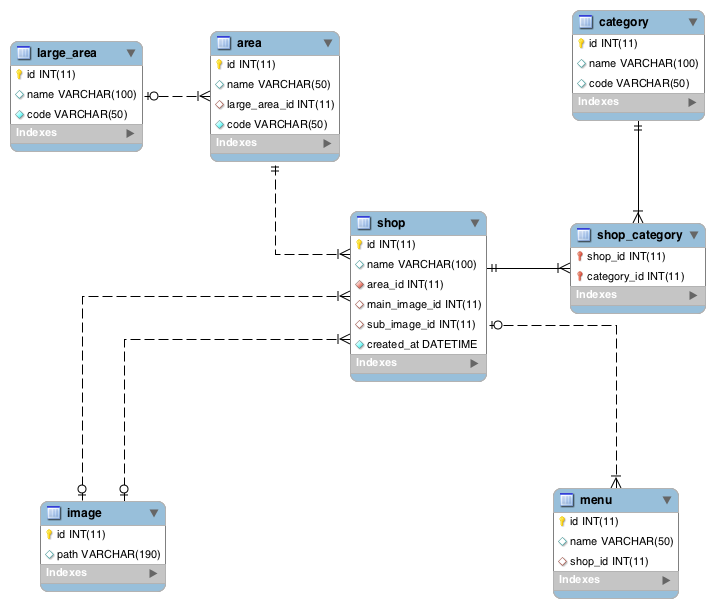

# Sdx.Db.Record

## 概要

各テーブルの一行を表現したクラス。`RecordSet`は複数の`Record`のコレクションです。

## 使い方

### クラスの準備

`Record`は`Connection.FetchRecord/FetchRecordSet<T:Record>(Select select)`で生成しますが、組み立てるのにテーブルの定義が必要です。テーブルの定義は`Sdx.Db.Table`クラスのサブクラスを作成して行います。

また、固有のユーティリティーメソッドを持たせたいので、`Record`クラスもサブクラスを作成します。

下記のDBを元に解説をします。

 

#### Tableクラス

一番基本的となる設定です。Tableクラス自体は各SELECTの中でJOINに利用され、JOIN時のデータを保有するため、複数生成されるクラスです。Tableの定義自体は複数生成する必要が無いなものなので`Sdx.Db.TableMeta`クラスのインスタンスとしてstaticなプロパティに保持します。本来はテーブル同士の関係も定義しますが、話を単純にするため、最初の例では省略します。

```c#
using System.Collections.Generic;

namespace Test.Orm.Table
{
  class Shop : Sdx.Db.Table
  {
    public static Sdx.Db.TableMeta Meta { get; private set; }

    static Shop()
    {
      Meta =  new Sdx.Db.TableMeta(
        "shop",
        new List<Column>()
        {
          new Column("id", isAutoIncrement: true, isPkey: true),
          new Column("name"),
          new Column("area_id", type: ColumnType.Integer),
          new Column("main_image_id", isNotNull: false),
          new Column("sub_image_id", isNotNull: false),
          new Column("login_id", isNotNull: false),
          new Column("password", isNotNull: false),
          new Column("created_at", type: ColumnType.DateTime),
        },
        new Dictionary<string, Relation>()
        {
          //他テーブルとの関係を設定します。
        },
        typeof(Test.Orm.Shop),
        typeof(Test.Orm.Table.Category)
      );
    }
  }
}
```

`TableMeta`コンストラクタの引数は下記のようになっています。

1. テーブル名
1. 主キー
1. カラムのリスト
1. 他テーブルとの関連（`Relation`の辞書）
1. Recordクラスのタイプ
1. Tableクラスのタイプ

カラムのリストは`Sdx.Db.Table.Column`のインスタンスです。コンストラクタの数が多くカラム名以外省略可能なので名前付き引数で呼び出してください。型情報`type`を指定すると自動的にValidationを生成する`Column.CreateValidatorList`が利用できます。

#### レコードクラス

レコードクラスからもテーブル定義にアクセスできるようするためstaticなプロパティが必要です。

```c#
namespace Test.Orm
{
  public class Shop : Sdx.Db.Record
  {
    public static Sdx.Db.TableMeta Meta { get; private set; }

    static Shop()
    {
      Meta = Test.Orm.Table.Shop.Meta;
    }
  }
}
```

#### リレーションを貼る

`shop`は複数の`menu`を持っています。この関係を設定してみます。

```c#
using System.Collections.Generic;

namespace Test.Orm.Table
{
  class Shop : Sdx.Db.Table
  {
    public static Sdx.Db.TableMeta Meta { get; private set; }

    static Shop()
    {
      Meta =  new Sdx.Db.TableMeta(
        "shop",
        new List<Column>()
        {
          new Column("id", isAutoIncrement: true, isPkey: true),
          new Column("name"),
          new Column("area_id", type: ColumnType.Integer),
          new Column("main_image_id", isNotNull: false),
          new Column("sub_image_id", isNotNull: false),
          new Column("login_id", isNotNull: false),
          new Column("password", isNotNull: false),
          new Column("created_at", type: ColumnType.DateTime),
        },
        new Dictionary<string, Relation>()
        {
          {
            "menu",
            new Relation(
              typeof(Test.Orm.Table.Menu),
              "id",
              "shop_id"
            )
          }
        },
        typeof(Test.Orm.Shop),
        typeof(Test.Orm.Table.Category)
      );
    }
  }
}
```

`Sdx.Db.Table.Relation`のインスタンスで関連を設定します。コンストラクタの引数は下記のようになっています。

1. TableクラスのType
1. 自分自身の参照カラム。`shop.id`になります。
1. 相手テーブルの参照ラカム。`menu.shop_id`です。

このようにして、テーブル同士の関係を設定していきます。[ユニットテストのテーブルクラス](/UnitTest/Test/Orm/Table)で様々な設定を確認できますので参考にしてください。


<br><br><br>
### Tableを使ったSELECTの組み立て

#### 単純な問い合わせ

```c#
var db = new Sdx.Db.SqlServerAdapter();
db.ConnectionString = "DB CONNECTION STRING";

var select = db.CreateSelect();
select.AddFrom(new Test.Orm.Table.Shop());

using(var conn = db.CreateConnection())
{
  conn.Open();
  var shops = conn.FetchRecordSet(select);
}
```

`Select.AddFrom`にTableのインスタンスをセットすると、カラムはTableMetaに設定したカラムが自動で全て追加されます。

`Connection.FetchRecordSet(select)`で`Record`のリストを、`Connection.FetchRecord(select)`で`Record`単体を取得します。問い合わせ結果が無い場合`FetchRecordSet`は空の`RecordSet`を、`FetchRecord`は`null`を返します。


カラムを変更したい場合は`Context.SetColumns()`/`Context.ClearColumn()`/`Context.AddColumn()`などのTableのカラム操作系メソッドを使用してください。

```c#
select
  .AddFrom(new Test.Orm.Table.Shop())
  .SetColumns("id", "name");
```

#### 一対多をJOINする

一対多の関係のテーブルをJOINすると、レコードが重複します。例えば、shopテーブルにmenuテーブルをJOINした場合、2つメニューを持ったお店は2行になって現れます。RecordSetはこれをうまくまとめてれます。

```sql
INSERT INTO shop (name, created_at, area_id) VALUES ('天府舫', '2015-01-03 12:30:00', (SELECT id FROM area WHERE name = '新宿'));

INSERT INTO menu (name, shop_id) VALUES ('干し豆腐のサラダ', (SELECT id FROM shop WHERE name = '天府舫'));
INSERT INTO menu (name, shop_id) VALUES ('麻婆豆腐', (SELECT id FROM shop WHERE name = '天府舫'));
INSERT INTO menu (name, shop_id) VALUES ('牛肉の激辛水煮', (SELECT id FROM shop WHERE name = '天府舫'));
```

```c#
var select = db.CreateSelect();
select
   .AddFrom(new Test.Orm.Table.Shop())
   .AddOrder("id", Sdx.Db.Sql.Order.ASC)
   ;

select.Context("shop")
   .InnerJoin(new Test.Orm.Table.Menu())
   .AddOrder("id", Sdx.Db.Sql.Order.ASC)
   ;

select.Context("shop")
    .Where.Add("name", "天府舫");

using(var conn = db.CreateConnection())
{
  conn.Open();
  var shops = conn.FetchRecordSet(select);

  Assert.Equal(1, shops.Count);
  Assert.Equal("天府舫", shops[0].GetString("name"));

  //メニューを取得。JOINしているのでここでDBへの問い合わせは発生しません。
  var menuList = shops[0].GetRecordSet("menu");
  Assert.Equal(3, menuList.Count);
  Assert.Equal("干し豆腐のサラダ", menuList[0].GetString("name"));
  Assert.Equal("麻婆豆腐", menuList[1].GetString("name"));
  Assert.Equal("牛肉の激辛水煮", menuList[2].GetString("name"));
}

```

#### 取得後の扱い

`RecordSet`が返すのは`Reocrd`のインスタンスです。`Test.Orm.Shop`のメソッドを呼び出したい場合はキャストが必要です。キャストして返すジェネリックメソッドも幾つか用意されています。具体的なクラスでオブジェクトを扱う方法を幾つか示します。

```c#
using(var conn = db.CreateConnection())
{
  conn.Open();
  var shops = conn.FetchRecordSet(select);

  //foreachはキャストの必要がありません。
  foreach(Test.Orm.Shop shop in shops)
  {

  }

  //ForEachメソッドにはキャストメソッドがります。
  shops.ForEach<Test.Orm.Shop>(shop => {

  });

  //RecordSetはIEnumerableを実装しています。
  shops.Cast<Test.Orm.Shop>().Where(shop => true);

  //indexを指定して取得するジェネリックメソッド
  Assert.Equal("天府舫", shops.Get<Test.Orm.Shop>(0).GetString("name"));
}
```
